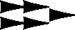

# Лабораторная работа №6
## Сегментация текста

### Вариант 11: Угаритский алфавит

### Исходные данные
- Фраза: `𐎀𐎁𐎂 𐎍𐎎𐎏 𐎛𐎚𐎗`
- Шрифт: `NotoSansUgaritic-Regular.ttf`, размер `92`
- Размер монохромного изображения: `892x123`
- Количество найденных символов: `11`

### Формулы профилей

```text
H(y) = sum_x I_b(x, y)
V(x) = sum_y I_b(x, y)
```

Где `I_b(x,y)=1` для черного пикселя и `0` для белого.

### 1. Подготовка строки

#### 1.1 Монохромное изображение фразы


### 2. Профили изображения

| Горизонтальный профиль | Вертикальный профиль |
|:----------------------:|:--------------------:|
|  |  |

### 3. Сегментация символов (по вертикальному профилю с прореживанием)

#### 3.1 Обрамляющие прямоугольники


#### 3.2 Вырезанные сегменты

- Сегмент 1: `[segment_01]` -> 
- Сегмент 2: `[segment_02]` -> 
- Сегмент 3: `[segment_03]` -> 
- Сегмент 4: `[segment_04]` -> 
- Сегмент 5: `[segment_05]` -> 
- Сегмент 6: `[segment_06]` -> 
- Сегмент 7: `[segment_07]` -> 
- Сегмент 8: `[segment_08]` -> 
- Сегмент 9: `[segment_09]` -> 
- Сегмент 10: `[segment_10]` -> 
- Сегмент 11: `[segment_11]` -> 

#### 3.3 Массив координат прямоугольников

| idx | x0 | y0 | x1 | y1 | w | h |
|---:|---:|---:|---:|---:|---:|---:|
| 1 | 30 | 48 | 101 | 67 | 72 | 20 |
| 2 | 120 | 11 | 191 | 67 | 72 | 57 |
| 3 | 210 | 10 | 229 | 87 | 20 | 78 |
| 4 | 272 | 10 | 291 | 87 | 20 | 78 |
| 5 | 296 | 10 | 315 | 87 | 20 | 78 |
| 6 | 320 | 10 | 339 | 87 | 20 | 78 |
| 7 | 358 | 10 | 418 | 87 | 61 | 78 |
| 8 | 455 | 10 | 518 | 88 | 64 | 79 |
| 9 | 562 | 16 | 639 | 112 | 78 | 97 |
| 10 | 658 | 40 | 735 | 58 | 78 | 19 |
| 11 | 754 | 18 | 861 | 60 | 108 | 43 |

CSV с координатами (`;`-разделитель): `results/segments_boxes.csv`

### 4. Профили символов выбранного алфавита

- Эталоны символов: `src/alphabet/templates/`
- Профили X/Y: `src/alphabet/profiles/`
- Построены для всех 30 символов угаритского алфавита варианта 11.

Пример (первые 6 символов):

| Символ | Эталон | Профиль X | Профиль Y |
|:------:|:------:|:---------:|:---------:|
| 𐎀 |  |  |  |
| 𐎁 |  |  |  |
| 𐎂 |  |  |  |
| 𐎃 |  |  |  |
| 𐎄 |  |  |  |
| 𐎅 |  |  |  |

### Вывод
Реализованы расчеты горизонтального и вертикального профилей, сегментация символов по профилю с прореживанием и построение профилей символов алфавита варианта 11. Получен массив координат прямоугольников в порядке чтения слева направо.
