# Лабораторная работа №6
## Сегментация текста

### Вариант 11: Угаритский алфавит

### Исходные данные
- Фраза: `𐎀 𐎁 𐎂 𐎍 𐎎 𐎏 𐎛 𐎚 𐎗`
- Ожидаемое количество символов без пробелов: `9`
- Шрифт: `NotoSansUgaritic-Regular.ttf`, размер `92`
- Размер монохромного изображения: `1036x123`
- Количество найденных символов: `9`

### Формулы профилей

```text
H(y) = sum_x I_b(x, y)
V(x) = sum_y I_b(x, y)
```

Где `I_b(x,y)=1` для черного пикселя и `0` для белого.

### 1. Подготовка строки

#### 1.1 Монохромное изображение фразы
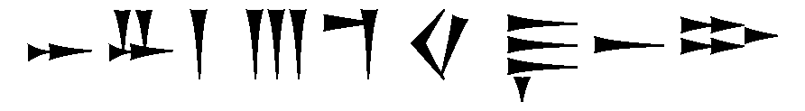

### 2. Профили изображения

| Горизонтальный профиль | Вертикальный профиль |
|:----------------------:|:--------------------:|
| 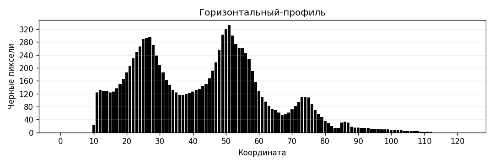 | 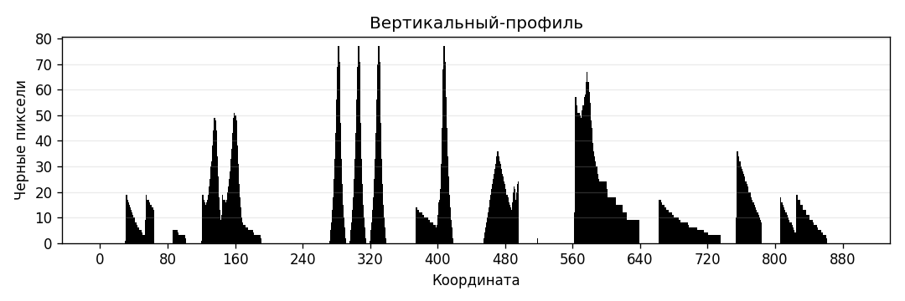 |

### 3. Сегментация символов

Из-за сложной структуры угаритских символов стандартная сегментация по нулевым провалам профиля может давать лишние разбиения. Поэтому использована сегментация по вертикальному профилю с априорно известным числом символов строки.

#### 3.1 Обрамляющие прямоугольники
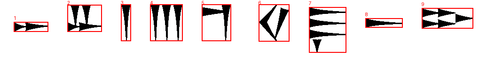

#### 3.2 Вырезанные сегменты

- Сегмент 1: `[segment_01]` -> 
- Сегмент 2: `[segment_02]` -> 
- Сегмент 3: `[segment_03]` -> 
- Сегмент 4: `[segment_04]` -> 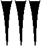
- Сегмент 5: `[segment_05]` -> 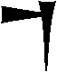
- Сегмент 6: `[segment_06]` -> 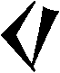
- Сегмент 7: `[segment_07]` -> 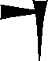
- Сегмент 8: `[segment_08]` -> 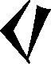
- Сегмент 9: `[segment_09]` -> 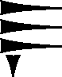

#### 3.3 Массив координат прямоугольников

| idx | x0 | y0 | x1 | y1 | w | h |
|---:|---:|---:|---:|---:|---:|---:|
| 1 | 29 | 47 | 102 | 68 | 74 | 22 |
| 2 | 143 | 10 | 216 | 68 | 74 | 59 |
| 3 | 257 | 9 | 278 | 88 | 22 | 80 |
| 4 | 319 | 9 | 388 | 88 | 70 | 80 |
| 5 | 429 | 9 | 491 | 88 | 63 | 80 |
| 6 | 550 | 9 | 615 | 89 | 66 | 81 |
| 7 | 657 | 15 | 736 | 113 | 80 | 99 |
| 8 | 777 | 39 | 856 | 59 | 80 | 21 |
| 9 | 897 | 17 | 1006 | 61 | 110 | 45 |

CSV с координатами (`;`-разделитель): `results/segments_boxes.csv`

### 4. Профили символов выбранного алфавита

- Эталоны символов: `src/alphabet/templates/`
- Профили X/Y: `src/alphabet/profiles/`
- Построены для всех 30 символов угаритского алфавита варианта 11.

Пример (первые 6 символов):

| Символ | Эталон | Профиль X | Профиль Y |
|:------:|:------:|:---------:|:---------:|
| 𐎀 |  | 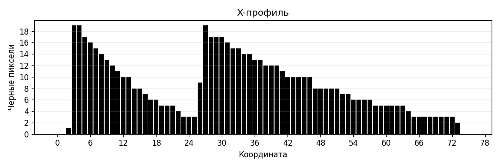 | 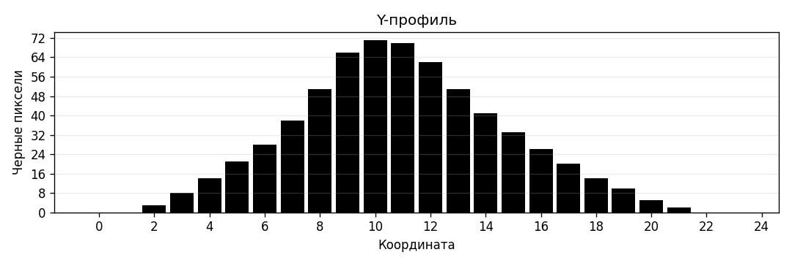 |
| 𐎁 |  | 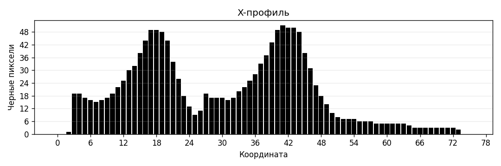 | 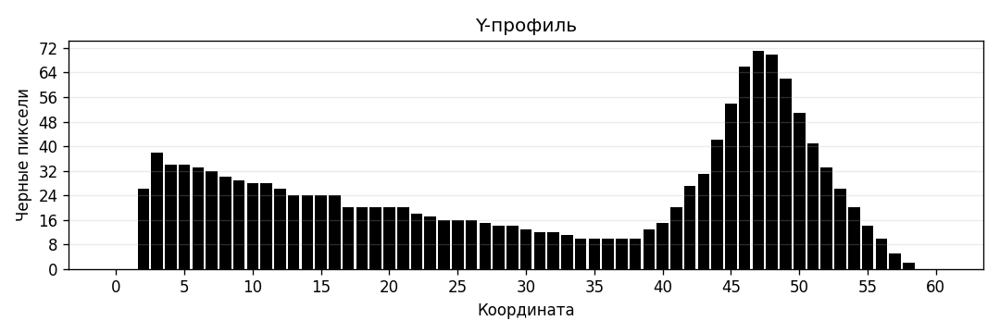 |
| 𐎂 | 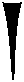 | 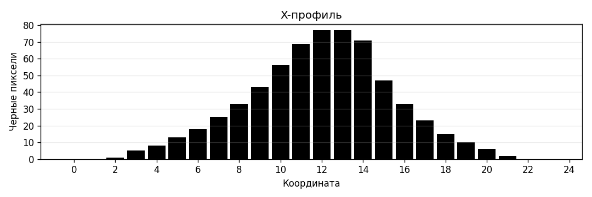 | 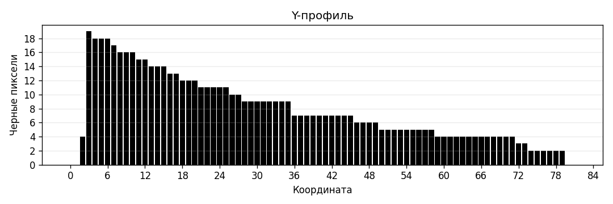 |
| 𐎃 | 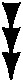 | 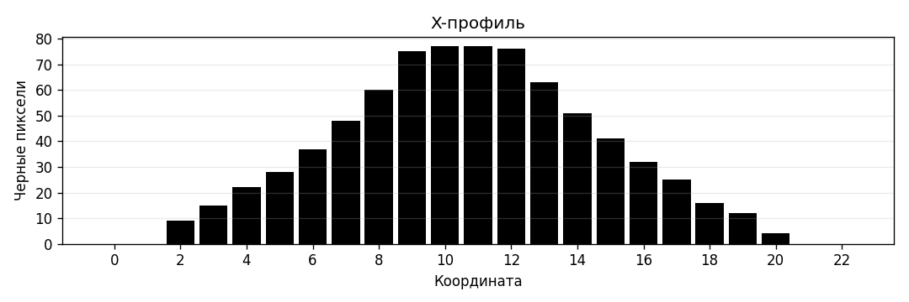 | 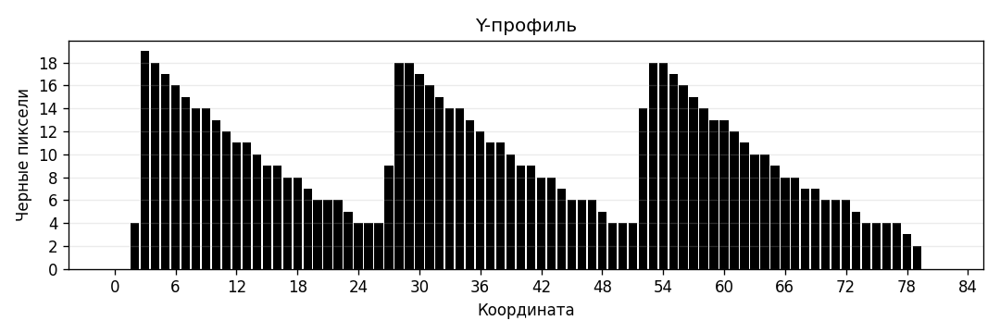 |
| 𐎄 |  | 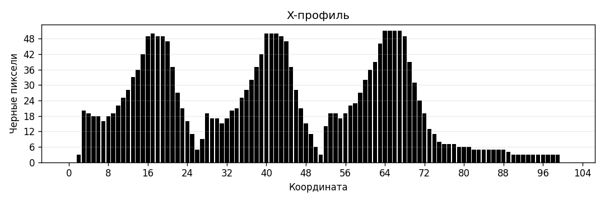 | 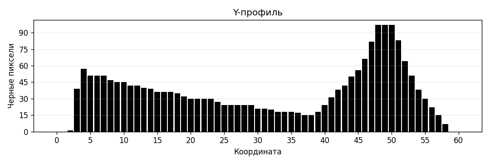 |
| 𐎅 | 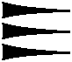 | 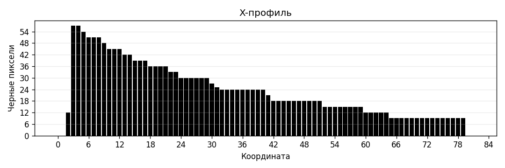 | 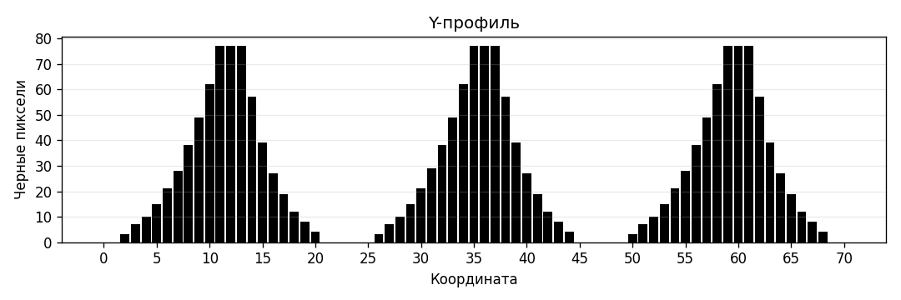 |

### Вывод
Реализованы расчёты горизонтального и вертикального профилей, сегментация строки на символы и построение профилей символов алфавита варианта 11. Получен массив координат прямоугольников в порядке чтения слева направо.
